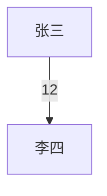

# wechat-social-analytics

基于 `wx-cli` 查询本地微信数据，回答微信社交关系和群聊活跃度问题。

## 可行性边界

先确认 `wx` 可用：

```bash
wx sessions --json -n 5
```

确认结果后再回答可行性：

- 群里最活跃 top 10：可直接做。使用 `wx stats <群名> --json` 的 `top_senders`。
- 群里互动拓扑图：可近似做。`wx history` 暴露群消息 `sender`，但不暴露 sender username。默认用时间相邻消息和引用消息构边，适合看互动结构，不等同于微信内部关系图。
- 过去 N 天谁和我交流最多：可做。默认统计最近私聊会话中，时间范围内双方消息总数。`wx-cli` 当前不稳定暴露私聊方向字段，默认不拆入站/出站。
- 和我共享最多群的好友 top 10：可做近似。默认从最近群会话扫描 `wx members`。如果用户要求完整群覆盖，需要用户提供群名列表，或等待 `wx-cli` 提供全量群列表命令。
- 每天指定群消息总结：可做。取指定群某一天的 `wx history` 和 `wx stats`，由 agent 总结主题、决定、待办、链接文件和未解决问题。自动每天运行需要用户指定群名和运行时间。

涉及微信数据时，说明数据来自本机缓存；微信未同步、未下载、已清理的数据不会被统计。

## 常用脚本

脚本路径：

```bash
node /Users/hwang/Projects/jzskills/wechat-social-analytics/scripts/wx-social-analytics.mjs <mode> [options]
```

模式：

```bash
# 1. 一个群里最活跃的 top 10
node /Users/hwang/Projects/jzskills/wechat-social-analytics/scripts/wx-social-analytics.mjs group-top --chat "AI群"

# 2. 一个群里互动最多拓扑图
node /Users/hwang/Projects/jzskills/wechat-social-analytics/scripts/wx-social-analytics.mjs group-topology --chat "AI群" --since 2026-05-01 --limit 5000 --mermaid

# 3. 过去 10 天谁和我交流最多
node /Users/hwang/Projects/jzskills/wechat-social-analytics/scripts/wx-social-analytics.mjs my-top --days 10 --sessions 300

# 4. 和我共享最多群的好友 top 10
node /Users/hwang/Projects/jzskills/wechat-social-analytics/scripts/wx-social-analytics.mjs shared-groups --sessions 1000

# 5. 指定群每日消息总结，默认总结昨天
node /Users/hwang/Projects/jzskills/wechat-social-analytics/scripts/wx-social-analytics.mjs group-summary --chat "AI群"

# 指定日期
node /Users/hwang/Projects/jzskills/wechat-social-analytics/scripts/wx-social-analytics.mjs group-summary --chat "AI群" --date 2026-05-13
```

## 口径

### 群活跃 top 10

优先使用：

```bash
wx stats "<群名>" --json
```

输出 `top_senders`，字段为 `sender` 和 `count`。如用户指定时间范围，传 `--since` / `--until`。

### 群互动拓扑

使用：

```bash
wx history "<群名>" --json --since YYYY-MM-DD -n 5000
wx members "<群名>" --json
```

构边规则：

- 相邻消息：A 后 B 在窗口内发言，且 A != B，则记 `A -> B` 一次。
- 引用消息：内容包含 `↳ 发送者: 原文` 时，记 `当前发送者 -> 被引用发送者`，权重更高。
- 默认窗口 `10` 分钟，可用 `--window-minutes` 调整。

输出时标注 `method: temporal_adjacency_and_quote`，避免把它解释为确定关系。

### 过去 N 天和我交流最多

使用 `wx sessions --json -n <数量>` 找私聊，再对每个私聊运行：

```bash
wx history "<display>" --json --since YYYY-MM-DD -n 5000
```

排序口径：

- `message_count`：该私聊在时间范围内的总消息数。
- `last_time`：该范围内最后一条消息时间。

如果用户问“谁找我最多”，说明当前脚本统计的是双方交流量，不是只统计对方发给我的消息。

### 共同群 top 10

默认从最近群会话扫描：

```bash
wx sessions --json -n 1000
wx members "<群名>" --json
```

对每个成员累加出现的群。排除无法识别的空成员。输出：

- `display`
- `username`
- `shared_group_count`
- `sample_groups`

如果用户要求覆盖所有群，先问用户要群名列表；不要声称 `wx sessions` 覆盖全量群。

### 指定群每日消息总结

使用：

```bash
node /Users/hwang/Projects/jzskills/wechat-social-analytics/scripts/wx-social-analytics.mjs group-summary --chat "<群名>" --date YYYY-MM-DD
```

默认 `--date` 为昨天。脚本输出：

- `message_count`
- `top_senders`
- `by_type`
- `by_hour`
- `messages`

总结结构：

```text
日期：
消息量：
主要话题：
决定：
待办：
链接/文件：
未解决问题：
活跃成员：
限制：
```

只总结消息里实际出现的信息，不补推断。`truncated_by_limit` 为 `true` 时，在限制里说明消息达到脚本上限；需要提高 `--limit` 后重跑。

如果用户说“每天发我指定群总结”“每天早上总结这个群”，需要先确认群名、运行时间和总结日期口径。确认后创建定时任务，任务 prompt 写成：

```text
使用 /Users/hwang/Projects/jzskills/wechat-social-analytics/scripts/wx-social-analytics.mjs group-summary 总结指定微信群昨天的消息，输出日期、消息量、主要话题、决定、待办、链接/文件、未解决问题、活跃成员和限制。
```

## 输出

回答时先给结论，再给口径和限制。

拓扑图可用 Mermaid：



不要展示微信内部 username，除非用户要求排查同名问题。
